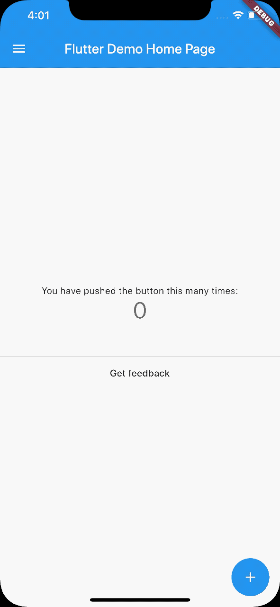

# Feedback

[](https://pub.dartlang.org/packages/feedback)
[](https://github.com/ueman/feedback/actions?query=workflow%3Aflutter)
[](https://codecov.io/gh/ueman/feedback)

A Flutter package for obtaining better feedback. It allows the user to provide interactive feedback 
directly in the app, by annotating a screenshot of the current page, as well as by adding text.
Get it on [pub.dev/packages/feedback](https://pub.dev/packages/feedback)!



## Motivation

It is often quite hard to understand user issues with an app.
This package aims to support the developer by making it easier for the user 
to provide good and helpful feedback. 
Thus this library tries to be pretty easy to use by the user and 
lightweight to integrate for the developer.

## Setup

First, you will need to add `feedback` to your `pubspec.yaml`:

```yaml
dependencies:
  flutter:
    sdk: flutter
  feedback: 0.3.0 # use the latest version found on pub.dev
```

Then, run `flutter packages get` in your terminal.

## Getting Started

Just wrap your app in a `BetterFeedback` widget and supply
an `onFeedback` function. The function gets called when 
the user submits his feedback. To show the feedback view just
call `BetterFeedback.of(context).show();`

```dart
import 'dart:typed_data';
import 'package:feedback/feedback.dart';
import 'package:flutter/material.dart';

void main() {
  runApp(
    BetterFeedback(
      child: const MyApp(),
      onFeedback: (
        BuildContext context,
        String feedbackText, // the feedback from the user
        Uint8List feedbackScreenshot, // raw png encoded image data
      ) {
        // TODO: upload to feedback to server or let the user share his feedback 
      },
    ),
  );
}
```

Provide a way to show the feedback panel by calling `BetterFeedback.of(context).show();`
Provide a way to hide the feedback panel by calling  `BetterFeedback.of(context).hide();` 

### Upload feedback

To upload the feedback you should use, for example, a [MultipartRequest](https://pub.dev/documentation/http/latest/http/MultipartRequest-class.html).

### Configuration

```dart
import 'dart:typed_data';
import 'package:feedback/feedback.dart';
import 'package:flutter/material.dart';

void main() {
  runApp(
    BetterFeedback(
      // You can customize the background color, ...
      backgroundColor: Colors.grey,
      // ... the colors with which the user can draw..
      drawColors: [Colors.red, Colors.green, Colors.blue, Colors.yellow],
      // ... and the language used by BetterFeedback.
      // You can pass any subclass of [FeedbackTranslation] to change the 
      // the text.
      translation: DeTranslation(),
      child: MyApp(),
      onFeedback: alertFeedbackFunction,
    ),
  );
}
```

For development purposes this library includes two methods which can be passed 
directly as `onFeedback`-callback. 
- `alertFeedbackFunction` which shows a simple alert dialog with the image and the corresponding user feedback.
- `consoleFeedbackFunction` which prints the user feedback and the image size with `print` to console.

## Tips, tricks and usage scenarios

- You can combine this with [device_info](https://pub.dev/packages/device_info)
and [package_info](https://pub.dev/packages/package_info) to 
get additional information about the users environment to better understand
his feedback and debug his issues. 
- You can record the users navigation with a [NavigatorObserver](https://api.flutter.dev/flutter/widgets/NavigatorObserver-class.html) and send it as an addition to the 
feedback of the user. This way you know how the user got to the location shown
in the screenshot.
- Use it as a view for [Sentry](https://sentry.io/)s [user feedback](https://docs.sentry.io/enriching-error-data/user-feedback/?platform=browser) to collect additional user 
information upon hitting an error.

## Known Issues and limitations

- Some draggable widgets like ReorderableListView look strange while dragging.
- Platform views are invisible in screenshots (like [webview](https://pub.dev/packages/webview_flutter) or [Google Maps](https://pub.dev/packages/google_maps_flutter))
- Why does the content of my Scaffold change (gets repositioned upwards) while I'm
    writing my feedback?
    - Probably because Scaffold.[resizeToAvoidBottomInset](https://api.flutter.dev/flutter/material/Scaffold/resizeToAvoidBottomInset.html) 
      is set to true. You could set it to false while the user provides feedback.

# A personal note

Let me know if you are using this in your app, I would love to see it.
