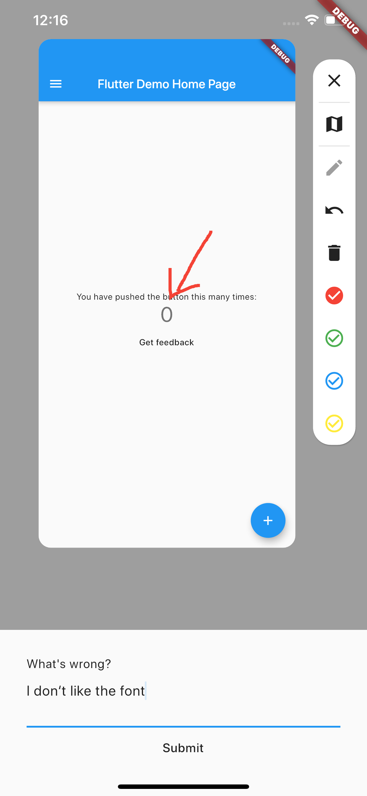

# feeback

A simple Flutter package for getting better feedback

## Getting Started

Just wrap your app in a `BetterFeedback` widget and supply
an `onFeedback` function. The function gets called when 
the user submits his feedback. To show the feedback view just
call `BetterFeedback.of(context).show();`

```dart
import 'package:feeback/feeback.dart';
import 'package:flutter/material.dart';

void main() {
  runApp(
    BetterFeedback(
      child: MyApp(),
      onFeedback: alertFeedbackFunction,
    ),
  );
}
```

## Sample


## Known Issues
- Any state is lost when switching between normal use and feedback view.
    - If anyone happens to know how to fix it, I would really appreciate it.
