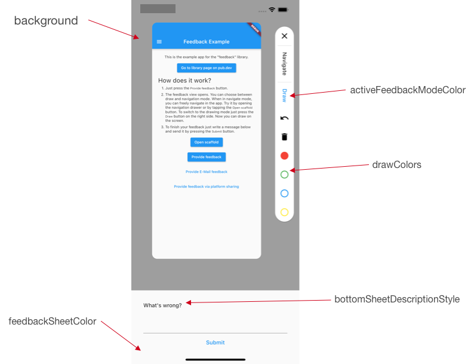

<p align="center">
  
</p>

<p align="center">
  <a href="https://pub.dartlang.org/packages/feedback"></a>
  <a href="https://github.com/ueman/feedback/actions?query=workflow%3Aflutter"></a>
  <a href="https://codecov.io/gh/ueman/feedback"></a>
  <a href="https://github.com/ueman#sponsor-me"></a>
  <a href="https://pub.dev/packages/feedback/score"></a>
  <a href="https://pub.dev/packages/feedback/score"></a>
  <a href="https://pub.dev/packages/feedback/score"></a>
</p>

---

A Flutter package for obtaining better feedback. It allows the user to provide interactive feedback 
directly in the app, by annotating a screenshot of the current page, as well as by adding text.

<p align="center">
  
</p>

You can view this as a video [here](img/movie.mp4).

## Motivation

It is often quite hard to achieve a very good user experience. The most important
aspect of creating a good user experience is to obtain and to listen to feedback
of your user. Focus groups are one solution to this problem but it is quite expensive. Another solution is to use this library to obtain direct feedback
of your users. This library is lightweight and easy to integrate and makes it
really easy for your users to send valuable feedback to you.

By obtaining the feedback with an annotated image it is much easier for you
get a good understanding of your users problem with a certain feature or screen
of your app. It is like the saying "A picture is worth a thousand words" because
a textual description can be interpreted in many ways which makes it harder to
understand.

## Setup

First, you will need to add `feedback` to your `pubspec.yaml`:

```yaml
dependencies:
  flutter:
    sdk: flutter
  feedback: x.y.z # use the latest version found on pub.dev
```

Then, run `flutter packages get` in your terminal.

## 🚀 Getting Started

Just wrap your app in a `BetterFeedback` widget.
To show the feedback view just call `BetterFeedback.of(context).show(...);`.
The callback gets called when the user submits his feedback. 

```dart
import 'package:feedback/feedback.dart';
import 'package:flutter/material.dart';

void main() {
  runApp(
    BetterFeedback(
      child: const MyApp(),
    ),
  );
}
```

Provide a way to show the feedback panel by calling `BetterFeedback.of(context)?.show(...);`
Provide a way to hide the feedback panel by calling  `BetterFeedback.of(context)?.hide();` 

### Upload feedback

To upload the feedback you should use, for example, a [MultipartRequest](https://pub.dev/documentation/http/latest/http/MultipartRequest-class.html).

### 🎨 Configuration & customization

```dart
import 'dart:typed_data';
import 'package:feedback/feedback.dart';
import 'package:flutter/material.dart';
import 'package:flutter_localizations/flutter_localizations.dart';

void main() {
  runApp(
    BetterFeedback(
      child: const MyApp(),
      theme: FeedbackThemeData(
        background: Colors.grey,
        feedbackSheetColor: Colors.grey[50]!,
        drawColors: [
          Colors.red,
          Colors.green,
          Colors.blue,
          Colors.yellow,
        ],
      ),
      localizationsDelegates: const [
        GlobalMaterialLocalizations.delegate,
        GlobalCupertinoLocalizations.delegate,
        GlobalWidgetsLocalizations.delegate,
        GlobalFeedbackLocalizationsDelegate(),
      ],
      localeOverride: const Locale('en'),
    ),
  );
}
```
How the properties of `FeedbackThemeData` correspond to the view can be seen in the following image. 


## Tips, tricks and usage scenarios

- You can combine this with [device_info](https://pub.dev/packages/device_info)
and [package_info](https://pub.dev/packages/package_info) to 
get additional information about the users environment to better understand
his feedback and debug his issues. 
- You can record the users navigation with a [NavigatorObserver](https://api.flutter.dev/flutter/widgets/NavigatorObserver-class.html) and send it as an addition to the 
feedback of the user. This way you know how the user got to the location shown
in the screenshot.
- Use it as a view for [Sentry](https://sentry.io/)s [user feedback](https://docs.sentry.io/enriching-error-data/user-feedback/?platform=browser) to collect additional user 
information upon hitting an error.

## Known Issues and limitations

- Platform views are invisible in screenshots (like [webview](https://pub.dev/packages/webview_flutter) or [Google Maps](https://pub.dev/packages/google_maps_flutter))
- Flutter for web is currently not supported, see this [issue](https://github.com/ueman/feedback/issues/13)

# Known usages

A list of apps which use this library can be found [here](usages.md).

# Sponsoring

I'm working on my packages on my free-time, but I don't have as much time as I would. If this package or any other package I created is helping you, please consider to [sponsor](https://github.com/ueman#sponsor-me) me. By doing so, I will prioritize your issues or your pull-requests before the others.
